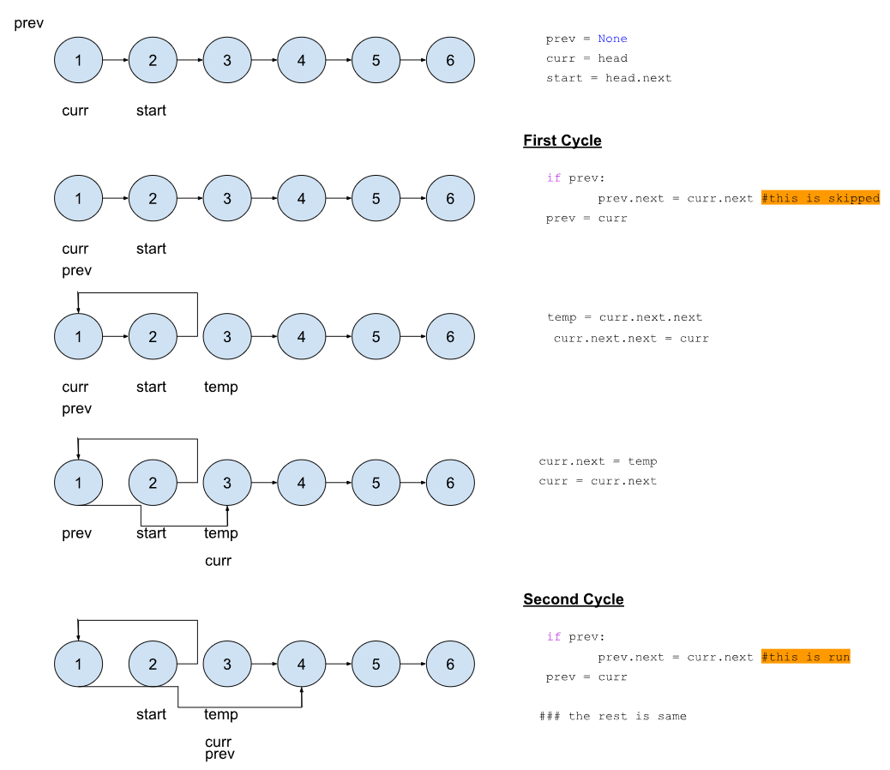

## 24. Swap Nodes with Pairs

>Description: [24. Swap Nodes with Pairs](https://leetcode.com/problems/swap-nodes-in-pairs/)\
Given a linked list, swap every two adjacent nodes and return its head. You must solve the problem without modifying the values in the list's nodes (i.e., only nodes themselves may be changed.)


Constraints:

- The number of nodes in the list is in the range `[0, 100]`. 
- <code>0 <= Node.val <= 10<sup>2</sup></code> 


### Solution: 

```python
# Definition for singly-linked list.
class ListNode:
    def __init__(self, val=0, next=None):
        self.val = val
        self.next = next


def swapPairs(head: ListNode) -> ListNode:
    if not head or not head.next:
        return head
    prev = None
    curr = head
    start = head.next


    while curr and curr.next:
        if prev:
            prev.next = curr.next
        prev = curr
        
        temp = curr.next.next
        curr.next.next = curr
        curr.next = temp
        curr = curr.next

    return start
```
### Breakdown of Solution:



- Note that `if not head or not head.next:` block. It is essential to prevent runtime error.
- Note `if prev: prev.next = curr.next: prev.next = curr.next` block. This is run starting the second iteration. Check out the above schematics to figure why it is essential.


### Complexity Analysis:

Time Complexity: *O(n)*

- linearly correlated with the length of the linked list

Space Complexity: *O(1)*

- storing pointer constants only